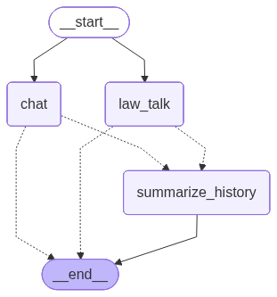

# LLM TALK SERVICE

## 현재 프로젝트 내 구현 기능

1. 법률 데이터를 RAG(Retrieval Augmented Generation) 사용을 위해 적재
   1. rag/pipeline_for_psql.py: 공공데이터를 활용하여 PostgreSQL에 데이터 적재
   2. rag/pipeline.py: PostgreSQL에 적재된 데이터를 RAG 검색을 위하여 Milvus에 인덱싱
   3. rag/make_collection.py: Milvus 데이터 적재를 위한 Collection 생성
2. RAG를 통해 법률 데이터를 검색하여 사용자에게 답변 생성
   1. rag/law_tools.py: RAG 검색을 위한 Agent 생성용 검색 LangChain Tool  
   2. agents/law_agent.py: RAG 검색을 위한 Agent 생성  
   3. chat/main.py: 사용자 대화를 위한 LangGraph 구성(아래 그림 참조)  
   
3. 사용자와의 대화를 위한 웹 UI 구현
   1. app_pages/home.py: 그냥 메인 홈
   2. app_pages/law_talk.py: 법률 데이터와 대화를 위한 웹 UI 구현


## 사용법

```
git clone https://github.com/sunjin7725/law_talk.git

cd law_talk
pip install pipenv
pipenv install
pipenv shell

cd app
python run.py
```

